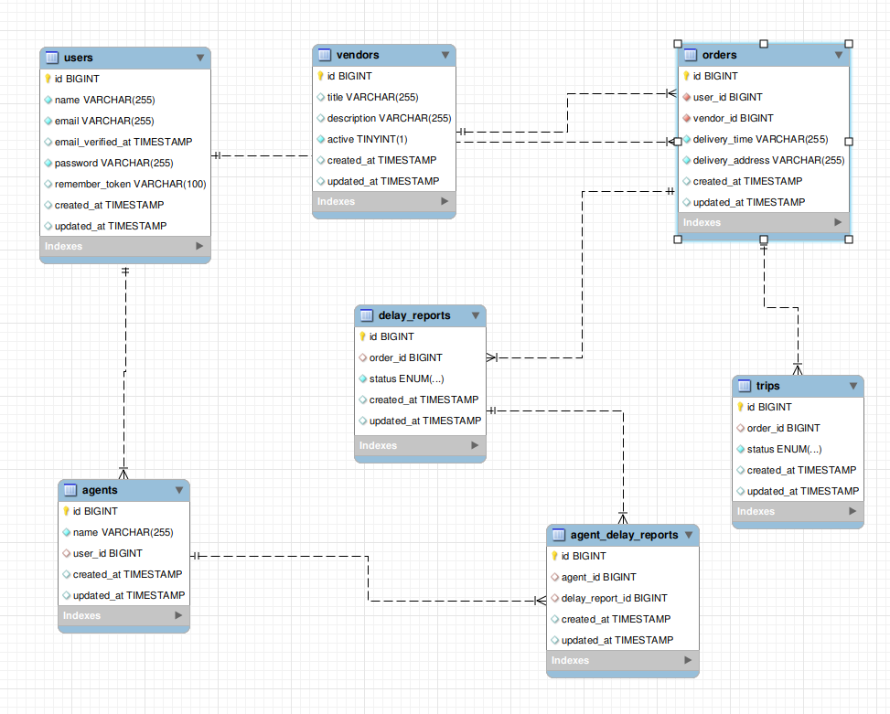

# delivery-delay-service
Its a service for notify delay of delivery food to users.

I have used Laravel 10 and Mysql as database for this project.

### Database schema

### Go to project
>> cd delivery-delay-service

### Install dependencies
>> composer install

### create .env
>> cp .env.example .env

### Running project
>> ./vendor/bin/sail up

### Running migrations
>> ./vendor/bin/sail artisan migrate

### Running seeders 
>> ./vendor/bin/sail artisan db:seed

### Running tests
>> ./vendor/bin/sail artisan test

## How to use system
We have 3 API that you can call them from postman.

1. Report an order as delayed order:  
`GET 127.0.0.1:8080/api/report/order/delay/{order-id}`

2. Request as agent to get new delayed order for working on it:  
`GET 127.0.0.1:8080/api/new/report/agent/{agent-id}`

3. Check each vendor reports for last week:   
`GET 127.0.0.1:8080/api/vendor/delay/reports/{vendor-id}`